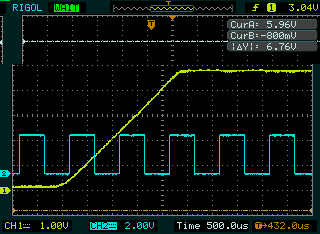

# Screenshot for Rigol DS1000D / DS1000E oscilloscopes
This grabs a screenshot from a DS1000D/E series scope via the
undocumented ```:lcd:data?``` SCPI method.
The "undocumented" method was helpfull described at https://www.improwis.com/projects/sw_USBTMC_RigolScopeWifi/

Later DS1000Z series scopes have a native PNG method, but the older
D/E series don't have anything documented.

This was tested on a DS1102D, running firmware 00.02.04

# Requirements
* pyvisa
* PIL (pillow or something compatible)

# Example
```
$ python riglol-snap.py 
Opening device: DS1EA122700492 -> saved to snap-riglol-20230817T101804.682946.png
```


# Bugs
The top section of the image is sometimes "rotated".  I have no idea why.  Power cycling the scope
will sometimes change the amount of the rotation, but it's always a small amount,
and always seems to be the same height.

Currently, this expects to receive a raw data block back, without the SCPI #<1-9>nnnnnnnn<binary>
header.  According to [improwis](https://www.improwis.com/projects/sw_USBTMC_RigolScopeWifi/) later firmware
revisions may correctly include the header.  To support this, the *IDN? query can be checked for the firmware
version, and the relevant tweaks the to pyvisa calls could be made.  Would need more testing.

# LICENSE
Licensed under your choice of the following SPDX IDs, whichver makes your own life easier
* Apache-2.0
* BSD-2-Clause
* ISC
* LGPL-2.0-or-later
* MIT

