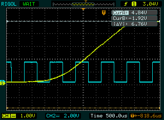

# Screenshot for Rigol DS1000D / DS1000E oscilloscopes
This grabs a screenshot from a DS1000D/E series scope via the
undocumented ```:lcd:data?``` SCPI method.
The "undocumented" method was helpfull described at https://www.improwis.com/projects/sw_USBTMC_RigolScopeWifi/

The intention here is for you to just keep using your scope as normal, but to simply grab screenshots,
instead of having to save them to a usb thumb drive, using the nasty file naming UI on the scope.
This does **not** attempt to provide any sort of control or cursors or anything!

Later DS1000Z series scopes have a native PNG method, but the older
D/E series don't have anything documented.

This was tested on a DS1102D, running firmware 00.02.04

# Requirements
* pyvisa
* PIL (pillow or something compatible)

# Example
```
$ python riglol-snap.py 
Opening device: DS1EA122700492 -> saved to snap-riglol-20230817T101804.682946.png
```


# Bugs
pyvisa is (relatively) slow to generate a list of plausible devices.  While I can pre-filter to just
suitable ones, I haven't found a way to not even look at anything other than USB devices. 

# LICENSE
Licensed under your choice of the following SPDX IDs, whichver makes your own life easier
* Apache-2.0
* BSD-2-Clause
* ISC
* LGPL-2.0-or-later
* MIT

